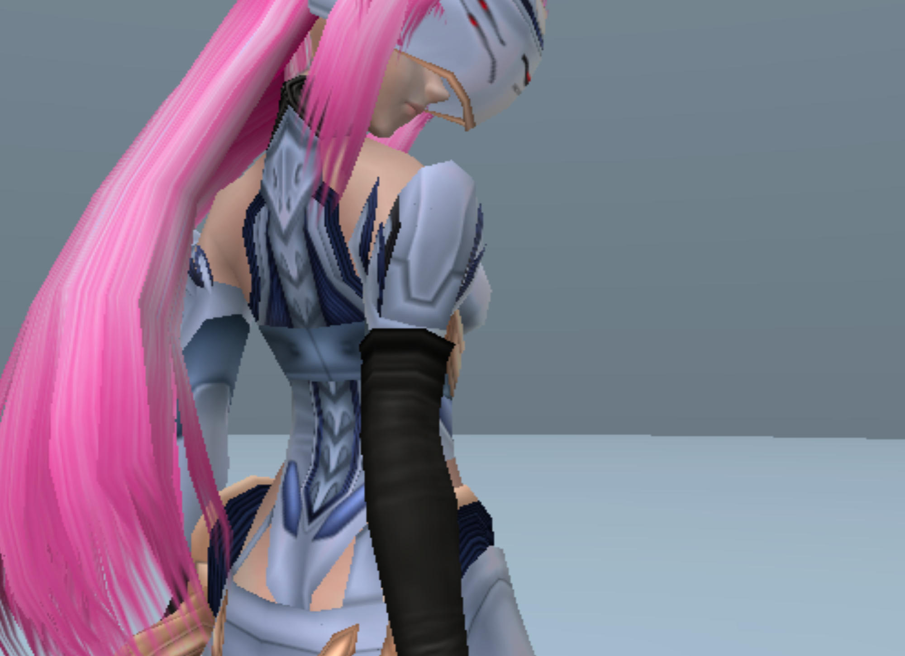
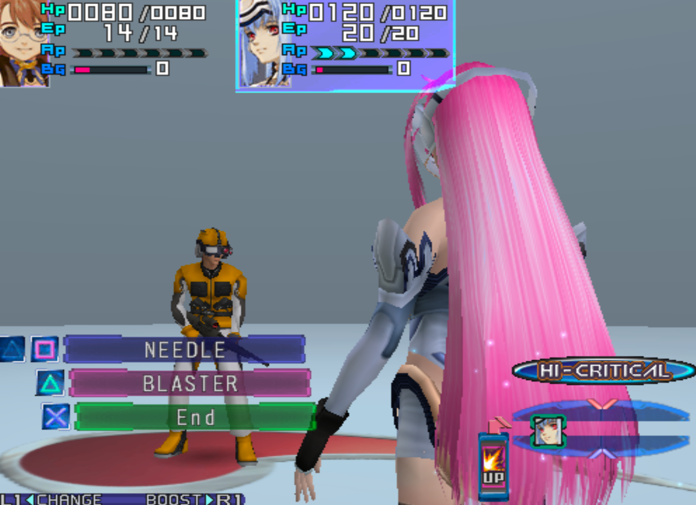
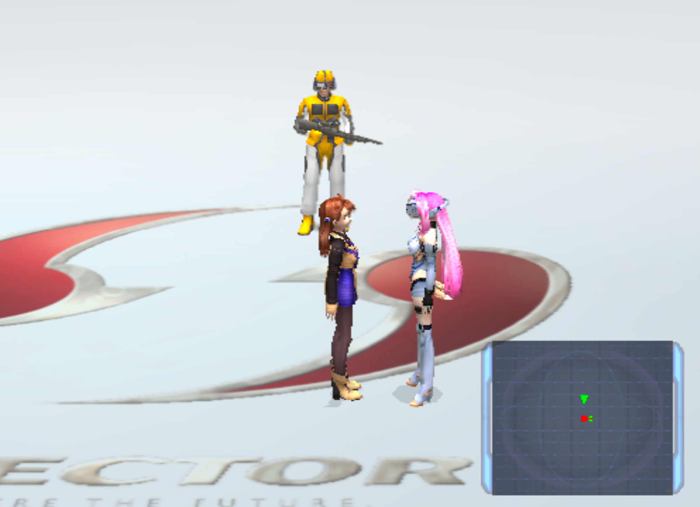

# Xenosaga Episode I Python Extractor

A complete extract-browse-**mod** kit for **Xenosaga Episode I — Der Wille
zur Macht (USA, SLUS-20469)** on PlayStation 2, written in pure Python with
**zero dependencies**. Point it at your own legally obtained disc image and
it will:

* **unpack** all ~9,000 files on the disc — including 58 full cutscene
  movies hidden *outside* the filesystem on the DVD's second layer;
* **convert** them to formats your desktop opens: textures → PNG,
  voice → WAV, movies → MP4, game text → UTF-8, cutscene scripts →
  decompilable Java (yes, [the cutscenes are Java](docs/JAVA.md));
* **write mods back** to a bootable ISO — texture recolors, dialogue edits,
  and a full fan-translation text pipeline, all verified byte-for-byte.

This tool ships no game data. It is the companion to
[Xenosaga3PythonExtractor](https://github.com/LinuxJessi/Xenosaga3PythonExtractor)
— same spirit, but Episode I predates the Episode III tooling by four years
and shares none of its container formats.

---

## 🖱️ The GUI — three ways to run it

Everything the kit does is available from a point-and-click GUI. It runs
locally in your browser (no server, no install, no Flask — Python's
standard library only), auto-detects your disc image, and offers every
command as a card with file pickers and a live log. Pick whichever of these
fits you:

### 1. Packaged app — no Python required at all

Download (or build — see [Building](#building-the-packaged-app)) the bundle
for your OS and double-click:

| OS | Double-click this |
|---|---|
| Windows | `Xenosaga-I-Extractor-windows/Xenosaga-I-Extractor.exe` |
| macOS | `Xenosaga-I-Extractor.app` |

The bundle embeds its own Python 3.12 runtime and (in release builds) a
portable ffmpeg for movie conversion — end users install **nothing**.
On macOS, a downloaded app is quarantined by Gatekeeper: right-click →
**Open** once (or `xattr -dr com.apple.quarantine Xenosaga-I-Extractor.app`),
after which it opens with a normal double-click.

### 2. Double-click launcher — source checkout, Python 3.9+ installed

| OS | Double-click this |
|---|---|
| Windows | `launch.bat` |
| macOS | `launch.command` (first time: right-click → Open) |
| Linux | `launch.sh` |

Each launcher `cd`s next to itself, finds your Python, and starts the GUI.
No build step, no `pip install` — the kit is stdlib-only.

### 3. From a terminal

```sh
python gui.py
```

All three routes run the same thing: a local web page with all nine
commands — **list / extract / classes / browse / verify / recolor KOS-MOS /
export text / import text / patch** — that shells out to `cli.py`
underneath, so the GUI and the command line can never disagree.

---

## What it looks like in-game

The kit's worked example, `pinkhair` (one click in the GUI), recolors
KOS-MOS's hair and writes a bootable modified ISO. These are real PCSX2
screenshots of the output — the point is that the recolor survives **every
place the texture is embedded**: field model, battle bundle, and cutscene
containers at once.

| | |
|---|---|
|  |  |
| Field/party model — raw true-colour strand pixels patched | Battle bundle — an independent embedded copy, also patched |


*The disc carries **12 separate copies** of the character texture in three
different container formats; `pinkhair.py` finds and patches all of them in
one pass. That sweep is the heart of the repack layer — see
[docs/MODDING.md](docs/MODDING.md).*

---

## The disc, explained

Understanding the kit starts with understanding the disc. It is an 8.47 GB
dual-layer DVD, and it has three "places" data can live:

```
Xenosaga Episode I (USA) DVD — 8.47 GB, dual layer
│
├─ LAYER 0 (~4.25 GB) — a plain ISO9660 filesystem, visible to any tool
│   ├─ SLUS_204.69            main executable (unstripped — full symbol names!)
│   ├─ OV01…OV12.OVL          5 engine overlays (menus, battle, casino…)
│   ├─ *.IRX                  13 sound/IO-processor drivers
│   │
│   ├─ XENOSAGA.00 ─┐         CHAIN 0 — "the game world" (1.43 GB)
│   ├─ XENOSAGA.01  ├─ 8,573 files: models, textures, scripts, menus,
│   ├─ XENOSAGA.02 ─┘         sound banks — the in-game "data\" tree
│   │
│   ├─ XENOSAGA.10 ─┐         CHAIN 1 — "the streaming data" (2.82 GB)
│   ├─ XENOSAGA.11  │         349 files: voice audio, cutscene motion
│   ├─ XENOSAGA.12  ├─        packs, cutscene scripts, and 45 video-only
│   └─ XENOSAGA.13 ─┘         movies
│
└─ LAYER 1 (~4.2 GB) — NOT in the filesystem at all
    └─ 58 full cutscene movies (MPEG-2 with sound), wall-to-wall,
       reached by the game via raw sector numbers
```

Three ideas make sense of that picture:

* **Bigfiles and chains.** The ISO filesystem only knows seven big opaque
  files (`XENOSAGA.00`–`.13`). All actual game data lives *inside* them.
  Files that belong together form a **chain**: chain 0 is `.00+.01+.02`
  read end-to-end as one continuous byte space, chain 1 is
  `.10+.11+.12+.13`. The split into pieces is just DVD bookkeeping — the
  game (and this kit) treats each chain as a single 1.4/2.8 GB region.

* **The TOC (table of contents).** The first file of each chain starts
  with a binary index mapping game paths like `char\pc\kosmos.xtx` to a
  sector offset and size *within the chain*. Parse the two TOCs and you
  can find all 8,922 indexed objects. (The unused tail of each TOC is
  filled with the string `MONOLITHSOFT Xenosaga Episode.1` on repeat —
  charming, and a handy end marker. Byte-level grammar in
  [docs/FORMATS.md](docs/FORMATS.md).)

* **The hidden layer.** The ISO9660 volume only describes layer 0 of the
  DVD. The entire second layer — half the disc! — is movies with no index
  of any kind: the game plays them by hardcoded raw sector addresses. The
  kit recovers all 58 by scanning for MPEG-2 stream starts
  (`carve.py`; the trick is that each movie's embedded clock starts near
  zero, which distinguishes a true beginning from mid-stream headers).

About 2,100 of the chain-0/1 objects are compressed with **ARX**,
Monolith's own dictionary coder. The kit doesn't just decompress it — its
compressor is a **byte-perfect clone** of Monolith's 2002 packer (2,094 of
2,095 compressed objects on the disc recompress *byte-identically*). That
matters for modding: recompressing an untouched file is a no-op, so any
difference between your modded ISO and the retail disc is your edit and
nothing else.

Two disc facts worth knowing even if you never mod anything:

* **Every executable is unstripped** — 8,115 named functions across the
  main ELF and five overlays. Episode III shipped fully stripped;
  Episode I is a decompiler's gift.
* **The cutscenes are compiled Java.** The engine embeds a JVM (803
  `Java_xeno_*` bridge symbols), and every `.evt` event file is a
  container of real JDK 1.1 class files, compiled with stock Sun `javac`,
  debug attributes intact — `system.evt` even ships `java/lang/Object`.
  The `classes` command lifts out ~2,200 classes ready for `javap` or any
  decompiler. Full story: [docs/JAVA.md](docs/JAVA.md).

---

## Command line quick start

The GUI shells out to these; use whichever you prefer.

```sh
python cli.py list    --iso "Xenosaga Episode I (USA).iso"          # peek at the TOCs
python cli.py extract --iso "Xenosaga Episode I (USA).iso" --out out/ --code
python cli.py classes --iso "Xenosaga Episode I (USA).iso" --out out/
python cli.py browse  --out out/     # textures→PNG, voice→WAV, movies→MP4…
python cli.py verify  --out out/     # re-check every extracted byte
```

`extract` produces:

```
out/
  dump/chain0/    8,573 files — the game's "data\" tree (models, textures, scripts…)
  dump/chain1/      349 files — streamed voice, cutscene packs, indexed movies
  dump/layer1/       58 movies carved from outside the filesystem
  browse/code/    SLUS_204.69 + 5 overlays + IOP modules      (--code)
  manifest.csv    one row per object: path, sector, size, compressed flag,
                  which bigfile it lives in and where
```

`dump/` is the disc as the game sees it; `browse` then builds a
human-readable mirror next to it (PNG/WAV/MP4/UTF-8). A guided tour of
what's in there — including the **eight developers' personal folders that
shipped on the retail disc** — is in [docs/BROWSING.md](docs/BROWSING.md).

## Modding — writing changes back

The disc is unusually friendly to modding: plain ISO9660, everything in
contiguous bigfiles, one binary TOC per chain. So the kit patches **in
place at computed offsets** — it never rebuilds the image, and untouched
bytes are provably untouched.

```sh
# replace any indexed object (give content uncompressed; ARX is applied as needed)
python cli.py patch --iso GAME.iso --out MODDED.iso \
    --set 'chain0:char\pc\kosmos.xtx=my_kosmos.xtx'
```

* `repack.py` patches objects in place, updates the TOC's size fields,
  refuses writes that exceed an object's sector allocation, and verifies
  every write by reading it back.
* `pinkhair.py` is the worked example (screenshots above): palette edits,
  true-colour pixel edits, and the disc-wide sweep for embedded copies.
* `textpack.py` is the **translator pipeline**: `text-export` pulls all
  914 in-game text objects (588 scene/menu `.txt` + 326 U.M.N. mail
  slots) into a plain UTF-8 tree, one file per object, each annotated
  with its Shift-JIS byte budget; `text-import` re-encodes, validates
  every file, and writes a patched ISO only when everything passes.
  Note the split that trips people up: U.M.N. conversations and mails
  render from these text objects, but **scene/cutscene dialogue is
  compiled into the Java scripts** — same-length dialogue edits work
  today (proven in-game with a French line in the opening tutorial);
  length-changing edits await a class-file rewriter. Details and the
  worked example: [docs/MODDING.md](docs/MODDING.md) §5.

Every mechanism — the in-place patcher, the ARX clone, the two kinds of
texture color, the 12-carrier sweep, debugging against the live game over
PCSX2's PINE socket — is written up in [docs/MODDING.md](docs/MODDING.md),
deliberately in enough detail that the tools can be modified or
reimplemented from the docs alone.

## Documentation map

| Doc | Read it for |
|---|---|
| [docs/CODEBASE.md](docs/CODEBASE.md) | **how the code is organized** — the reading stack, data flow of each command, where to start if you want to change something |
| [docs/BROWSING.md](docs/BROWSING.md) | guided tour of the extraction output — what to open first, grep recipes |
| [docs/MODDING.md](docs/MODDING.md) | how the repack layer works, byte by byte — patching, recoloring, translating, verifying |
| [docs/FORMATS.md](docs/FORMATS.md) | byte-level format reference (TOC, ARX, XTX, LEX, FL00, audio, movies) with verification evidence |
| [docs/JAVA.md](docs/JAVA.md) | the headline find: cutscenes as JDK 1.1 Java, and how to decompile them |
| [docs/FINDS.md](docs/FINDS.md) | easter eggs and dev leftovers — staff folders on the retail disc, debug tools in shipped cutscenes, Gamera |
| [docs/HISTORY.md](docs/HISTORY.md) | what this disc records about Monolith Soft in 2002 |

## What's decoded (and what isn't yet)

Decoded and converted by `browse`:

* **Textures** (`.xtx` → PNG) — raw PS2 GS-memory images: swizzled 8-bit
  indexed regions plus true-colour regions on one canvas, palettes
  resolved via the paired `.lex` model materials or corner-scan.
* **Streamed voice** (`.vds`/`.vdm`/`.vda` → WAV) — headerless PS2 SPU
  ADPCM, stereo interleaved every 0x400 bytes, 48 kHz. (If a decode ever
  sounds slow/echoey/choppy, the interleave is wrong — not the rate.)
* **Movies** (`.pss`/`.ipu` → MP4, needs ffmpeg — bundled in release
  builds) — including the audio track ffmpeg itself misparses; movies
  with sound also emit separate video-only MP4 and audio WAV for
  undub/redub work.
* **Game text** (Shift-JIS `.txt` → UTF-8) — readable instead of mojibake.
* **Cutscene scripts** (`.evt` → `.class`) — decompile with `javap -c -p`,
  CFR, or Krakatau.
* **Music** — sequenced, not streamed (Procyon Studio SMD/SWD; the
  retail files literally embed `Yasunori Mitsuda / PROCYON STUDIO`).
  Instrument samples and a full sequence catalogue extract today;
  faithful playback needs an SMD synth (open project).

Not done yet: real titles for the 58 layer-1 movies (needs the playback
table in the ELF), an SMD synth, full palette coverage for multi-palette
sprite atlases, `.lex` mesh geometry export (xenotool does OBJ),
`.esd`/`.esp`/`.sed`/`.jnt` decoders. Formats and evidence:
[docs/FORMATS.md](docs/FORMATS.md).

## Building the packaged app

`python build.py` (requires `pip install pyinstaller`) freezes the kit
into the self-contained bundle described at the top — GUI and CLI
executables side by side, embedded Python, one folder, no install.
PyInstaller does not cross-compile: build on Windows for the `.exe`, on
macOS for the `.app` (`.github/workflows/release.yml` builds both in CI
on tag push). `python build.py --clean` wipes previous build output
first. Zip the macOS app with `ditto -c -k --keepParent` so symlinks and
exec bits survive. The deliberate packaging choices (one-folder not
one-file, no UPX — both for antivirus friendliness) are explained in
[docs/MODDING.md](docs/MODDING.md) §7.

## Credits

ARX decompression, the XTX canvas/swizzle layout, and the LEX material
tables were learned from [Lakuwu's xenotool](https://github.com/Lakuwu/xenotool)
— credited throughout [docs/FORMATS.md](docs/FORMATS.md) where each piece
is used. The ARX *compressor*, the TOC grammar, the layer-1 carver, the
Java class carver, the audio interleave, the movie audio demux, and the
whole repack layer were reverse-engineered for this kit.
